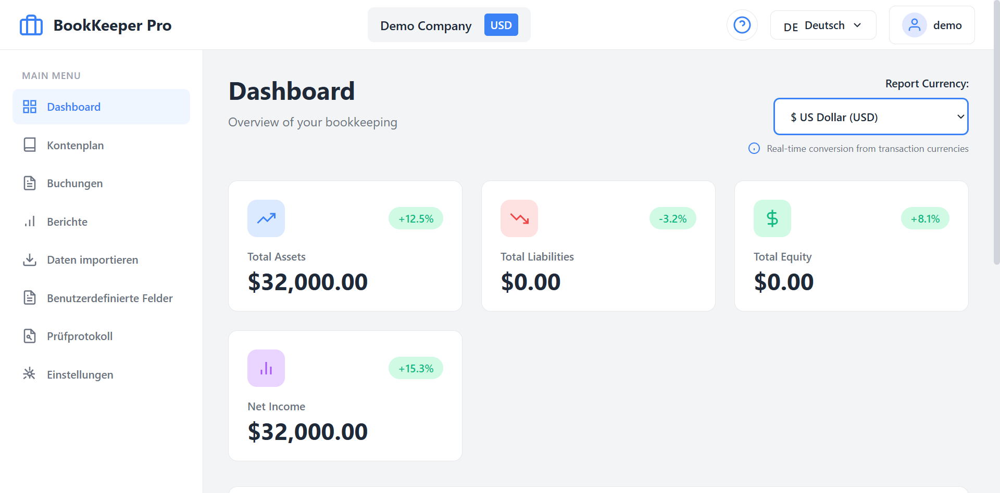
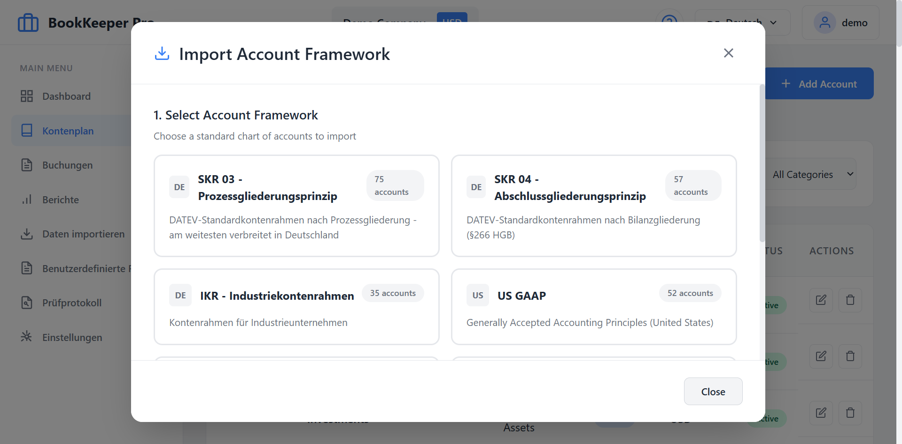
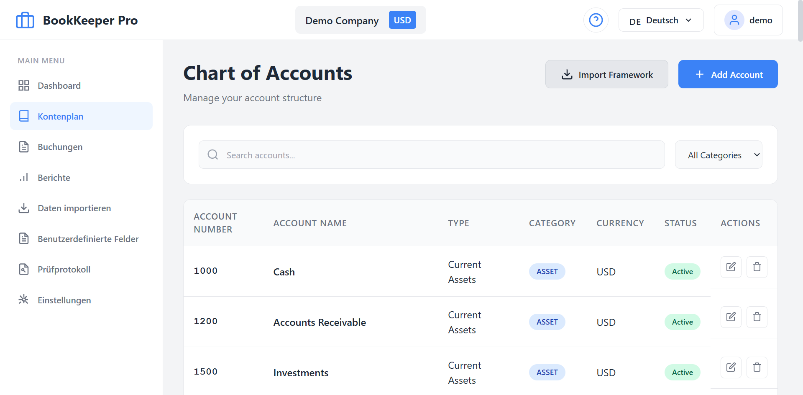
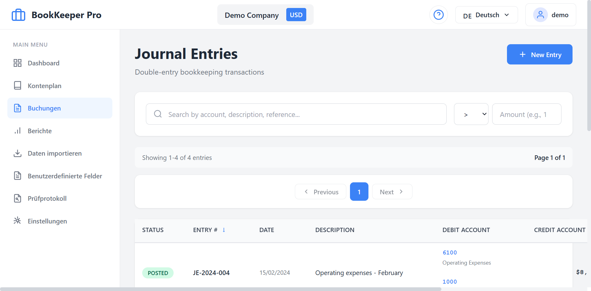
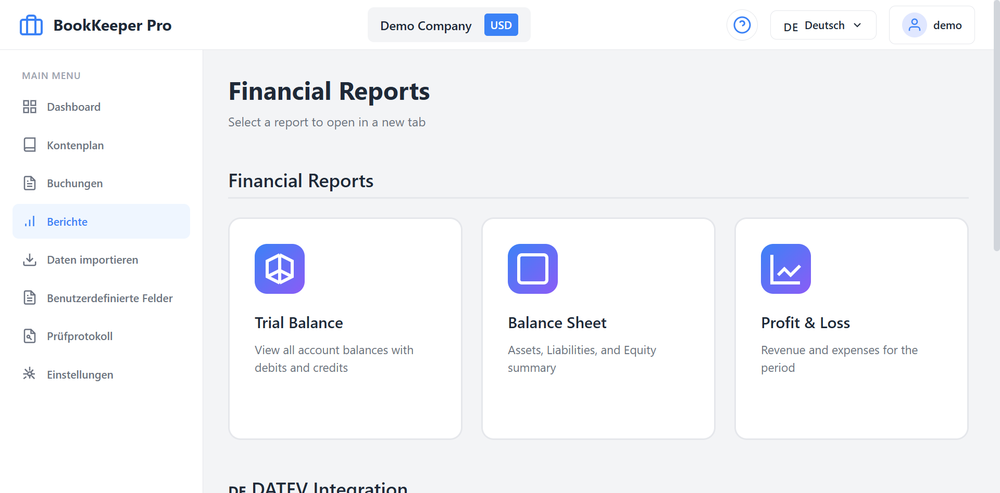
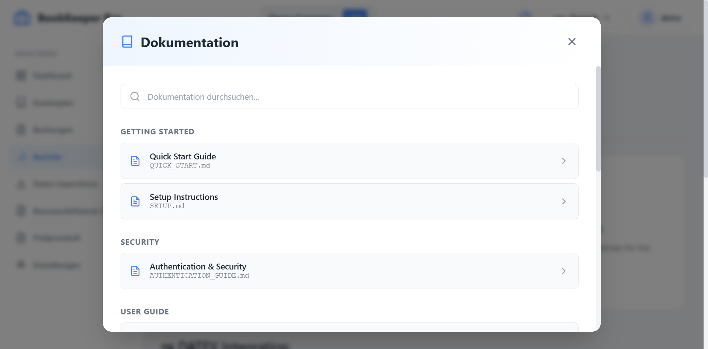

# International Bookkeeping System

A comprehensive, modern bookkeeping application built with Angular and designed to work with PostgreSQL + TimescaleDB. This application supports double-entry accounting, multi-currency operations, and can handle millions of bookings efficiently.

## 📸 Application Screenshots

### 📊 Dashboard - Financial Overview


*Real-time financial metrics, activity summary, and quick actions for managing your bookkeeping*

---

### 📁 Chart of Accounts - Standard Framework Import


*Import from 7 international standard account frameworks: SKR03, SKR04, IKR (Germany), US GAAP, IFRS, PCG (France), PGC (Spain)*

---

### 📋 Chart of Accounts Table


*Manage your complete chart of accounts with search, filtering, and categorization*

---

### 📝 Journal Entries - Double-Entry Bookkeeping


*Record and manage all transactions with automatic debit/credit balance validation and GoBD compliance*

---

### 📈 Financial Reports & DATEV Export


*Generate Trial Balance, Balance Sheet, and P&L reports. Export to DATEV format for German tax advisors*

---

### 📖 Documentation System - Built-in Help


*Access comprehensive documentation directly in the application with searchable index and markdown rendering*

---

## 🌟 Features

### Core Functionality
- **Double-Entry Accounting**: Full support for double-entry bookkeeping principles
- **Multi-Currency Support**: Handle transactions in multiple currencies with exchange rate management
- **Chart of Accounts**: Comprehensive account management with DATEV-style structure
- **Journal Entries**: Create, post, and manage journal entries with real-time balance validation
- **Custom Fields System**: 🆕 Extend journal entries with custom data fields
  - Flexible field types (TEXT, NUMBER, DECIMAL, DATE, BOOLEAN, SELECT)
  - Pre-configured insurance fields (Policy/Claim numbers, types, statuses)
  - Visual editor for field management
  - Sample data generator (1M+ insurance bookings)
  - Aggregation and grouping by custom fields
- **Financial Reports**:
  - Trial Balance
  - Balance Sheet
  - Profit & Loss Statement
  - Policy & Claim Summaries 🆕
- **Data Import**: Import accounts and journal entries from CSV/Excel files
- **Dashboard**: Real-time metrics and key performance indicators

### Technical Features
- **Scalable**: Built on TimescaleDB for handling millions of transactions
- **International**: Multi-timezone support and localization-ready
- **Modern UI**: Clean, professional interface with responsive design
- **Type-Safe**: Full TypeScript implementation
- **Standalone Components**: Modern Angular architecture

## 📁 Project Structure

```
bookkeeping/
├── bookkeeping-frontend/          # Angular frontend application
│   ├── src/
│   │   ├── app/
│   │   │   ├── components/       # Feature components
│   │   │   │   ├── dashboard/
│   │   │   │   ├── accounts/
│   │   │   │   ├── journal-entries/
│   │   │   │   ├── reports/
│   │   │   │   ├── import/
│   │   │   │   └── layout/       # Header, Sidebar
│   │   │   ├── models/           # TypeScript interfaces
│   │   │   ├── services/         # API services
│   │   │   └── app.config.ts     # App configuration
│   │   └── styles.css            # Global styles
│   └── package.json
└── database/
    └── bookkeeping-schema.sql    # PostgreSQL database schema
```

## 🗄️ Database Schema

The application uses a comprehensive PostgreSQL schema with TimescaleDB extensions:

### Main Tables
- **organizations**: Company/organization information
- **fiscal_periods**: Accounting periods management
- **currencies**: Supported currencies (ISO 4217)
- **exchange_rates**: Currency exchange rates with historical data
- **account_types**: Account categories (Assets, Liabilities, Equity, Revenue, Expenses)
- **accounts**: Chart of accounts
- **journal_entries**: Transaction headers
- **journal_entry_lines**: Transaction line items (debits/credits)
- **account_balances**: Materialized account balances
- **import_jobs**: Data import tracking

### Key Features
- **TimescaleDB Hypertables**: Optimized for time-series data
- **Continuous Aggregates**: Pre-computed reports for fast queries
- **Views**: Trial Balance, Balance Sheet, Profit & Loss
- **Functions**: Balance validation, entry posting, account calculations

## 🚀 Getting Started

### Prerequisites
- Node.js 18+ and npm
- Angular CLI 17+
- PostgreSQL 14+ with TimescaleDB extension
- Git

### Frontend Setup

1. **Install dependencies:**
```bash
cd bookkeeping-frontend
npm install
```

2. **Configure API endpoint:**
Edit `src/environments/environment.ts`:
```typescript
export const environment = {
  production: false,
  apiUrl: 'http://localhost:3000/api'
};
```

3. **Start development server:**
```bash
npm start
# or
ng serve
```

4. **Access the application:**
Open your browser to `http://localhost:4200`

### Database Setup

1. **Create PostgreSQL database:**
```sql
CREATE DATABASE bookkeeping;
```

2. **Enable TimescaleDB extension:**
```sql
\c bookkeeping
CREATE EXTENSION IF NOT EXISTS timescaledb;
CREATE EXTENSION IF NOT EXISTS "uuid-ossp";
```

3. **Run the schema:**
```bash
psql -U postgres -d bookkeeping -f database/bookkeeping-schema.sql
```

### Backend API (Required)

This frontend requires a REST API backend. The expected endpoints are:

#### Organizations
- `GET /api/organizations` - List organizations
- `GET /api/organizations/:id` - Get organization
- `POST /api/organizations` - Create organization
- `PUT /api/organizations/:id` - Update organization
- `DELETE /api/organizations/:id` - Delete organization

#### Accounts
- `GET /api/account-types` - List account types
- `GET /api/organizations/:orgId/accounts` - List accounts
- `GET /api/accounts/:id` - Get account
- `POST /api/organizations/:orgId/accounts` - Create account
- `PUT /api/accounts/:id` - Update account
- `DELETE /api/accounts/:id` - Delete account

#### Journal Entries
- `GET /api/organizations/:orgId/journal-entries` - List entries
- `GET /api/journal-entries/:id` - Get entry
- `POST /api/organizations/:orgId/journal-entries` - Create entry
- `PUT /api/journal-entries/:id` - Update entry
- `DELETE /api/journal-entries/:id` - Delete entry
- `POST /api/journal-entries/:id/post` - Post entry
- `POST /api/journal-entries/:id/void` - Void entry

#### Reports
- `GET /api/organizations/:orgId/reports/trial-balance` - Trial balance
- `GET /api/organizations/:orgId/reports/balance-sheet` - Balance sheet
- `GET /api/organizations/:orgId/reports/profit-loss` - P&L statement
- `GET /api/organizations/:orgId/dashboard` - Dashboard metrics

## 🎨 UI Components

### Dashboard
- Key metrics cards (Assets, Liabilities, Equity, Net Income)
- Activity summary
- Quick actions for common tasks

### Chart of Accounts
- Searchable account list
- Filter by category
- Create/Edit/Delete accounts
- Account hierarchy support

### Journal Entries
- Double-entry transaction form
- Real-time balance validation
- Multi-line entries
- Post and void functionality
- Entry status tracking (Draft, Posted, Void)
- Custom fields support 🆕

### Custom Fields Manager 🆕
- Visual field editor
- Field type selection (TEXT, NUMBER, DECIMAL, DATE, BOOLEAN, SELECT)
- Validation rules configuration
- Formatting templates
- Reorder fields with drag controls
- One-click insurance field setup
- Sample data generator (1M+ records)

### Reports
- Trial Balance with totals
- Balance Sheet (Assets, Liabilities, Equity)
- Profit & Loss Statement
- Policy Summary Report 🆕
- Claim Summary Report 🆕
- Export to CSV/Excel
- Custom field filtering 🆕

### Import Data
- CSV/Excel file upload
- Import history tracking
- Progress monitoring
- Template download

## 🛠️ Development

### Build for Production
```bash
cd bookkeeping-frontend
npm run build
```

The build artifacts will be stored in the `dist/` directory.

### Run Tests
```bash
npm test
```

### Code Style
```bash
npm run lint
```

## 📊 Database Performance

The schema is optimized for high-volume bookkeeping:

- **TimescaleDB Hypertables**: Automatic partitioning by time for `journal_entries`
- **Continuous Aggregates**: Pre-computed monthly summaries
- **Materialized Views**: Fast report generation
- **Indexes**: Optimized for common query patterns

Expected performance:
- Handles millions of journal entries
- Sub-second report generation
- Real-time dashboard metrics

## 🌍 Multi-Currency Support

The system supports:
- Multiple currencies per organization
- Historical exchange rates
- Automatic base currency conversion
- Currency-specific decimal places

## 🎯 Custom Fields System (New!)

### Overview
Extend journal entries with custom data fields tailored to your business. Perfect for insurance companies, real estate, healthcare, retail, and more.

### Key Features
- **10+ Field Types**: TEXT, NUMBER, DECIMAL, DATE, BOOLEAN, SELECT
- **Validation Rules**: Enforce data quality with min/max, patterns, required fields
- **Formatting Templates**: Auto-format values (e.g., POL-12345678)
- **Pre-configured Templates**: One-click setup for insurance operations
- **Sample Data Generator**: Generate 1M+ test records instantly
- **Aggregation & Grouping**: Built-in views for policy and claim summaries

### Insurance Use Case
The system includes pre-configured fields for insurance companies:
- **Policy Management**: Policy numbers, master policies, policy types, premiums
- **Claims Processing**: Claim numbers, master claims, status tracking, amounts
- **Customer Data**: Insured party information, contact details
- **Reporting**: Aggregate by policy type, claim status, date ranges

### Quick Start
1. Navigate to **Custom Fields** in the sidebar
2. Click **"Create Insurance Fields"** for instant setup
3. Click **"Generate Sample Data"** to create 1M test bookings
4. View **Reports** → Policy/Claim Summaries for aggregations

### Customization
Create your own fields for any business model:
- **Real Estate**: Property IDs, lease numbers, tenant info
- **Healthcare**: Patient IDs, provider NPIs, procedure codes
- **Retail**: Order numbers, customer IDs, store locations
- **Manufacturing**: Work orders, SKUs, batch numbers

**See [CUSTOM_FIELDS_GUIDE.md](CUSTOM_FIELDS_GUIDE.md) for complete documentation.**

## 🔒 Security Considerations

When implementing the backend API:
- Implement authentication and authorization
- Validate all double-entry transactions (debits = credits)
- Prevent modification of posted entries
- Implement fiscal period locking
- Audit trail for all transactions
- Rate limiting for API endpoints

## 📝 Data Model

### Double-Entry Bookkeeping Rules
1. Every transaction must have at least one debit and one credit
2. Total debits must equal total credits
3. Posted entries cannot be modified (void and create new)
4. Closed fiscal periods cannot accept new entries

### Account Types
- **Assets**: Normal balance = Debit
- **Liabilities**: Normal balance = Credit
- **Equity**: Normal balance = Credit
- **Revenue**: Normal balance = Credit
- **Expenses**: Normal balance = Debit

## 🌐 Free Hosting & Deployment

Deploy your own instance for **FREE** on:
- **Frontend**: [Vercel](https://vercel.com) (100% free, unlimited bandwidth)
- **Backend**: [Render.com](https://render.com) (Free tier with 750h/month)

**📖 Complete deployment guide**: See [DEPLOYMENT.md](DEPLOYMENT.md) for step-by-step instructions.

**⚡ Quick Deploy**:
1. Fork this repository
2. Sign up for Vercel (GitHub login)
3. Sign up for Render (GitHub login)
4. Follow the [deployment guide](DEPLOYMENT.md)
5. Your app will be live in ~5 minutes!

**Live Demo**: Share your deployed URL with anyone to showcase the application.

## 🤝 Contributing

This is a demonstration/template project. Feel free to:
- Fork and customize for your needs
- Submit issues for bugs or suggestions
- Contribute improvements via pull requests

## 📄 License

This project is provided as-is for educational and commercial use.

## 🙏 Acknowledgments

- Built with Angular 17
- Database powered by PostgreSQL and TimescaleDB
- DATEV-inspired account structure
- Modern UI design principles

## 📞 Support

For questions or issues:
- Check the database schema documentation in `database/bookkeeping-schema.sql`
- Review the Angular component code for implementation details
- Consult PostgreSQL and TimescaleDB documentation for database optimization

---

**Built with ❤️ for modern bookkeeping**

---

## 💼 Professional Services

Would you like to create feature-rich services & apps in short time without expensive developers working on it for weeks and months? Let me help you. I live in Hamburg.

### 📞 Contact Me

**Germany:** +49 1520 464 14 73

**Italy:** +39 345 345 0098

**Email:** mario.muja@gmail.com

I am looking forward to hearing from you!

